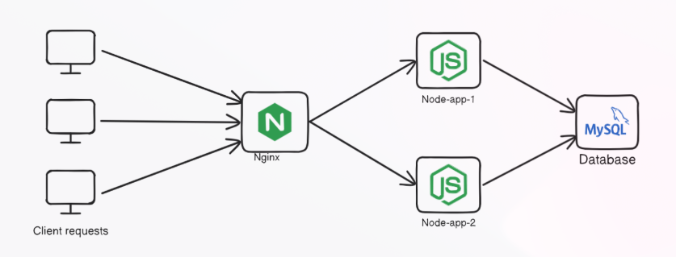

# Node.js Layer 4 Load Balancer

This repository demonstrates a **Layer 4 TCP load-balanced Node.js environment** using Nginx and MySQL in Docker. The setup consists of:

- Two identical Node.js applications
- Nginx acting as a Layer 4 load balancer
- MySQL database container
- Docker network for container communication

---

## System Design



**Description:**

1. **Node-app-1**: Listens on port `3001`, connects to MySQL.
2. **Node-app-2**: Listens on port `3002`, connects to MySQL.
3. **Nginx**: Load balances TCP traffic between the two Node apps.
4. **MySQL**: Stores user data; accessible by both Node apps.

**Flow:**

1. Client sends request → hits Nginx (port 80)  
2. Nginx forwards TCP connection to Node-app-1 or Node-app-2 (round-robin)  
3. Node app interacts with MySQL and responds back to the client  

---

## Project Structure

```
system-design/
└─ nodejs-layer4/
   ├─ Node-app-1/
   │  ├─ package.json
   │  ├─ index.js
   ├─ Node-app-2/
   │  ├─ package.json
   │  ├─ index.js
   ├─ nginx/
   │  ├─ Dockerfile
   │  └─ nginx.conf
   └─ README.md
```


